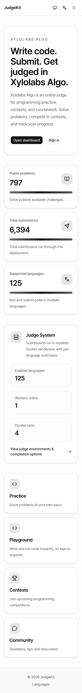
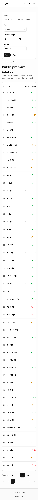
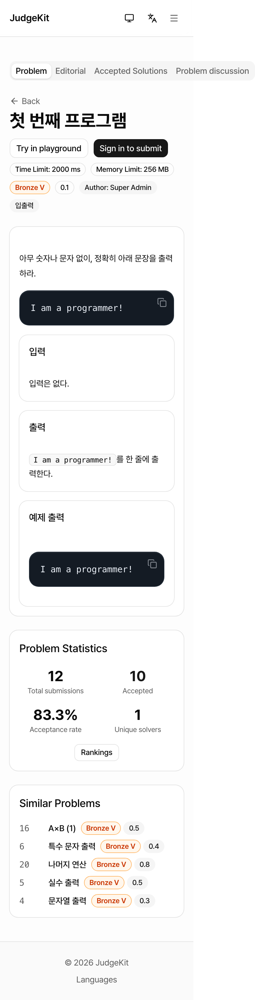
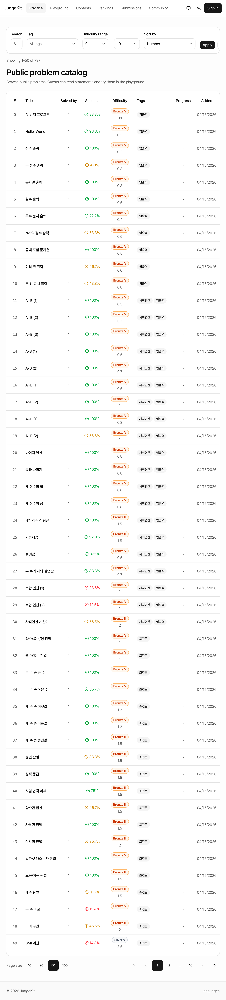
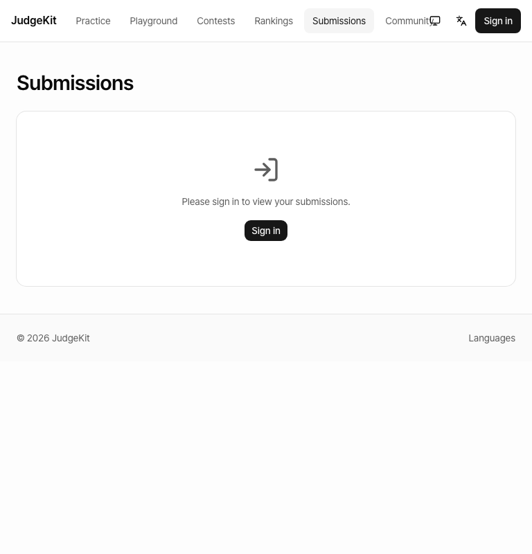
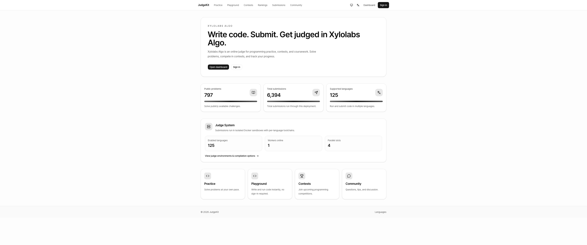
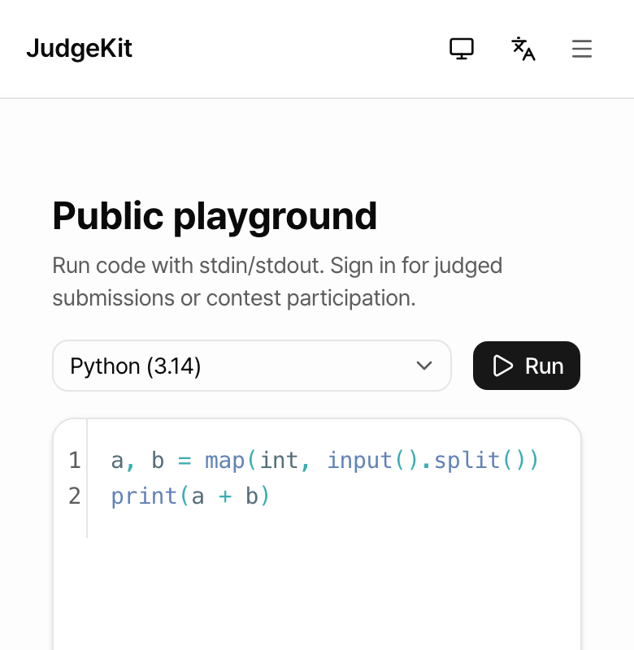
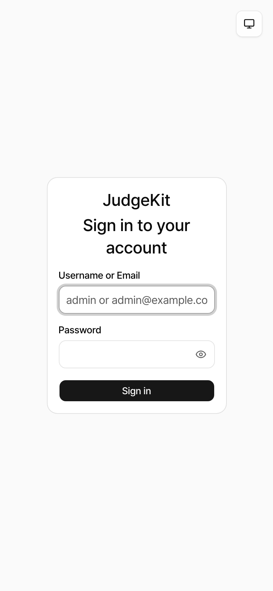
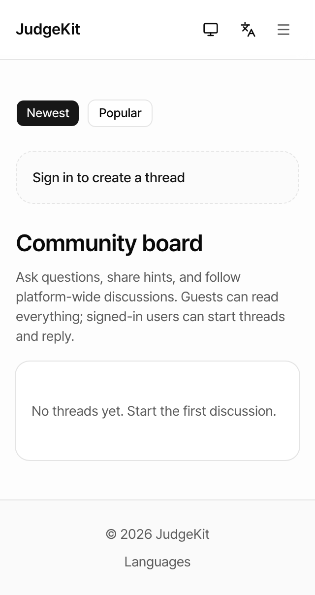

# 08 — Responsive Live Review (algo.xylolabs.com)

**Date:** 2026-05-03
**Target:** https://algo.xylolabs.com (production, signed-out)
**Method:** Headless Chromium via Playwright. 15 viewports x 10 public pages = 150 captures, plus problem-detail page across 10 viewports, vertical-resize scenarios on 3 pages, and a horizontal breakpoint sweep across 16 widths.
**Evidence:** 215 screenshots in `.context/reviews/2026-05-03-multi-perspective-v2/screenshots/`. Raw metric JSON in `raw-data.json`, `recap-data.json`, `problem-data.json`. Capture scripts in `capture.ts`, `capture-problem.ts`, `recap.ts`.

---

## 1. Executive Summary

**Overall responsive grade: B-**

The site holds its width well — across all 150 captures, **zero horizontal overflows** were detected on any of the public pages on captured viewports. Layouts collapse cleanly from 320 px up through 3440 px. The header reverts to a hamburger below 768 px, mobile card layouts replace tables on `/rankings` and `/submissions`, and the editor on `/playground` is usable down to 320 px.

That said, the experience has real, repeatable defects that will hurt phone-based exam takers and any Korean-only user trying to sign in. The most important issues:

| Severity | Count | Examples |
|---|---|---|
| Critical (blocks task) | 2 | Login page has no language switcher; problem-list table truncates score / difficulty / tags columns on phones without horizontal scroll |
| High (overlap / readability) | 4 | Header nav collides with theme icon at 768 px; tier/difficulty badges overflow on 320 px problem header; mobile-landscape (`844x390`) gets desktop UI; ultrawide screens leave 60–70 % whitespace |
| Medium (touch targets) | 1 | Theme toggle 36×36 and locale switcher / hamburger 32×32 — under the 44 px iOS / 48 px Material guideline |
| Low (polish) | 3 | Community page H1 is below the action chips; rankings username truncates; pagination buttons in problem table are 19×19 |

Vertical resize for the keyboard-open scenario is **good** — header is `position: static`, not sticky, so the soft keyboard does not occlude code. The `sticky top-6` on the auth-only submit panel never appears for guests so it's not in scope here.

---

## 2. Per-Page Findings

Cells: OK = no detected layout problem. CLIP = right-side content truncated (no scroll). LANG = missing language switcher. OVERLAP = nav/icon collision. NA = page returns 404 in production.

| Page | 320 | 375 | 390 | 414 | 667 lnd | 844 lnd | 768 | 820 | 1024 | 1280 | 1920 | 3440 |
|---|---|---|---|---|---|---|---|---|---|---|---|---|
| `/` Landing | OK | OK | OK | OK | OK | OK (\*1) | OVERLAP | OK | OK | OK | WIDE-WS | WIDE-WS |
| `/login` | LANG | LANG | LANG | LANG | LANG | LANG | LANG | LANG | LANG | LANG | LANG | LANG |
| `/practice` | CLIP | CLIP | CLIP | CLIP | CLIP | CLIP (\*1) | OVERLAP | OK | OK | OK | WIDE-WS | WIDE-WS |
| Problem detail | CLIP | CLIP | CLIP | CLIP | OK | OK | OVERLAP | — | OK | WIDE-WS | WIDE-WS | — |
| `/contests` | OK | OK | OK | OK | OK | OK (\*1) | OVERLAP | OK | OK | OK | WIDE-WS | WIDE-WS |
| `/rankings` | TRUNC | OK | OK | OK | OK | OK (\*1) | OVERLAP | OK | OK | OK | WIDE-WS | WIDE-WS |
| `/playground` | OK | OK | OK | OK | OK | OK (\*1) | OVERLAP | OK | OK | OK | WIDE-WS | WIDE-WS |
| `/submissions` | OK | OK | OK | OK | OK | OK (\*1) | OVERLAP | OK | OK | OK | WIDE-WS | WIDE-WS |
| `/community` | H1-ORDER | H1-ORDER | H1-ORDER | H1-ORDER | H1-ORDER | H1-ORDER | OVERLAP | H1-ORDER | OK | OK | WIDE-WS | WIDE-WS |
| `/languages` | OK | OK | OK | OK | OK | OK | OVERLAP | OK | OK | OK | WIDE-WS | WIDE-WS |
| `/signin` `/privacy` `/groups` | NA | NA | NA | NA | NA | NA | NA | NA | NA | NA | NA | NA |

(\*1) `844x390` is iPhone landscape (e.g. iPhone 14 in landscape orientation). It crosses the `md:` breakpoint at 768 px and gets the desktop nav rendered into a 390-px-tall canvas with a 40-px-tall header — uncomfortable for phone users. The 667x375 case correctly stays in mobile mode.

> Note: `/signin`, `/privacy`, and `/groups` were in the test plan but **all return HTTP 404 from production**. The actual public routes are `/login`, and there is no public `/privacy` or `/groups` (groups is `/dashboard/groups`, requires auth; privacy lives under the `(public)` route group in source but is not deployed). The original task referred to legacy paths.

---

## 3. Per-Viewport Findings

### 320 × 568 (iPhone SE 1st gen) — works mostly, table-clip is the headline issue



`practice` table renders inline with no horizontal scroll. Columns "Solved by", "Success", "Difficulty", "Tags", "Progress", "Added" are visually present but **clipped past the right edge** without an overflow indicator. See `screenshots/320x568-practice.png`. Users on the smallest viewport see a "Title — 1 — 83.x" row and nothing else. Pagination chevrons render but are 19 × 19 px (well under any touch-target guideline).



Problem detail at 320 px has a similar tab-bar issue: the tab strip "Problem | Editorial | Accepted Solutions | Problem discussion" is cut off after "Problem discussi" on the right edge.



### 375 × 667 / 390 × 844 / 414 × 896 — same as 320 only with more horizontal room

The truncated practice columns become 1–2 columns visible instead of 0, but the rightmost columns still clip. Card layouts on `/rankings` and `/submissions` work as advertised.

### 667 × 375 (iPhone SE landscape) — fine

Stays in mobile mode (no hamburger needed because viewport ≤ 768). Header / footer / cards all work.

### 844 × 390 (iPhone 14 Pro Max landscape) — wrong UI mode

Crosses the 768 px breakpoint and gets the **desktop nav crammed onto a 390-px-tall page**. The user is clearly on a phone in landscape, but the page treats them like a tablet. Filter labels "Search / Tag / Difficulty range / Sort by" are visible but each input is ~120 px wide and chained in a row. Ergonomically poor. See `screenshots/844x390-practice.png`.



### 768 × 1024 (iPad mini portrait) — header nav overlaps theme icon

At exactly 768 px, the desktop nav fits but the **rightmost link "Community" is overlapped by the theme toggle icon**. See `screenshots/sweep-768.png` vs `screenshots/sweep-1024.png` for the contrast — at 1024 px it's clean.



This is a classic insufficient-margin bug between `<nav>` (left flex group) and the right action cluster. The collision is fixed if the header gains a `lg:` breakpoint that adds an extra `lg:gap-4` or pushes the user/theme/locale buttons into a `lg:flex` only block.

Source: `src/components/layout/public-header.tsx:178` — the nav is `hidden min-w-0 flex-1 items-center gap-1 md:flex`, and the right cluster is `ml-auto hidden items-center gap-1 md:flex`. With six nav items + theme + locale + sign-in button, the natural width at 768 px exceeds the 720-px content area inside `max-w-6xl px-4`.

### 820 × 1180 (iPad Air portrait) — clean
Past the collision threshold; no issues observed.

### 1024 / 1280 / 1440 — clean and well-spaced

Desktop nav reads naturally, content fills `max-w-6xl` (~1152 px), table rows are comfortable.

### 1920 × 1080 / 2560 × 1440 / 3440 × 1440 — content stranded in centre

Container caps at `max-w-6xl` (~1152 px). On a 3440-wide ultrawide, that leaves ~38 % of the canvas filled and ~62 % blank.



This is intentional based on `src/components/layout/public-header.tsx:169` (`max-w-6xl`) but feels stark for stat-grid pages (rankings, submissions, problem list) where users on big monitors expect to see more rows at once. Recommend bumping the table-heavy pages to `max-w-7xl` or `max-w-screen-2xl` while keeping marketing pages narrow.

---

## 4. Vertical Viewport Resize Findings (the address-bar / keyboard scenario)

This was the explicit ask. Tested on `/`, `/playground`, and `/practice` at three heights: 844 (full), 600 (address bar visible), 400 (keyboard open).

| Scenario | Header sticky? | Header height | Submit/Run reachable? | Notes |
|---|---|---|---|---|
| `/` @ 390x844 | **No** (`position: static`) | 61 px | n/a | No issues |
| `/` @ 390x600 | No | 61 px | n/a | No issues |
| `/` @ 390x400 | No | 61 px | n/a | No issues |
| `/playground` @ 390x844 | No | 61 px | Yes (Run button visible above the fold) | 3 sticky elements detected — all internal CodeMirror gutters/announcer (`div.cm-gutters`, `div.cm-announced`, internal input). These are inside the editor and stay clipped to the editor box, so they don't fight with the keyboard. |
| `/playground` @ 390x600 | No | 61 px | Yes | Same |
| `/playground` @ 390x400 | No | 61 px | Yes | The editor card consumes most of the remaining 339 px. User can still see the "Run" button after a short scroll. |
| `/practice` @ 390x844 | No | 61 px | n/a | 4 sticky elements but all are hidden `<input>`s used by the filter row (Tailwind shadcn pattern) — visually invisible. Not a real sticky overlap. |



**Verdict:** No sticky-header / mobile-keyboard occlusion. Header is `position: static` (`src/components/layout/public-header.tsx:161`), so when the address bar appears or the keyboard opens, the header simply scrolls off — the user keeps full access to inputs and editor.

Caveats:
- The auth-only submit panel on `/practice/problems/[id]/page.tsx:619` uses `sticky top-6`. Guests never see it (they get a "Sign in to submit" prompt instead). For logged-in students taking exams on a phone, this sticky panel **could** clip behind the keyboard. Out of scope for this signed-out review, but flagged for follow-up.
- The CodeMirror editor's internal `div.cm-gutters` is sticky inside the editor box — this is correct CodeMirror behaviour and does not interact with the OS chrome.

---

## 5. Critical Bugs

### 5.1 `/login` has no locale switcher on any viewport


Compare with the home page, which shows ThemeToggle + LocaleSwitcher + (hamburger). On `/login`, the header chrome is suppressed and only a floating Theme button is rendered — there is **no way for a Korean speaker on a phone to switch the UI to Korean from the login screen**. This is a real conversion-killer for a Korean-first platform that expects students to find the platform via SMS / link and sign in cold.

Severity: **Critical** for the recruiting-test and student-exam use cases. Add a LocaleSwitcher to `/login`.

### 5.2 `/practice` table clips columns 4–9 on phones with no scroll affordance


Visible columns at 320 px: `# | Title | Solved by | Succ…` (where "Succ…" is itself truncated). The "Difficulty / Tags / Progress / Added" columns are not rendered as cards, not horizontally scrollable, and not visually marked as truncated. This is a regression vs the existing `tests/e2e/responsive-layout.spec.ts:170` pattern that uses card layout on `/rankings` and `/submissions` — `/practice` was apparently not converted.

Severity: **Critical** for student / homework use. A student trying to pick the next problem on a phone can't see difficulty or tags. Convert the practice table to a card list at `< md` like rankings and submissions already do.

---

## 6. High-Priority Polish

### 6.1 Header nav overlaps theme icon at 768 px


Fix in `src/components/layout/public-header.tsx`: either (a) raise the nav cutoff from `md:flex` to `lg:flex` so the hamburger covers the awkward range 768–1023, or (b) shrink the right-cluster horizontal gap and add `mr-2` between nav and right group.

### 6.2 Problem header metadata wraps awkwardly on 320–414
The row "Time Limit / Memory Limit / Tier badge / 0.1 / Author" wraps onto multiple lines and the tier badge appears alone on one line in `screenshots/problem-320x568.png`. Cosmetic, but noticeable.

### 6.3 Community board H1 below action chips

"Newest / Popular" and "Sign in to create a thread" CTA are rendered above the H1 "Community board". Visual hierarchy: the H1 should come first; tabs and actions belong under or next to it.

### 6.4 Ultrawide whitespace on data-heavy pages
On `/rankings`, `/submissions`, `/practice` with thousands of rows, the table is capped at ~1152 px on a 1920 px or larger monitor. Power users (admins, contest judges) will want to see more rows. Recommend per-page max-width override.

---

## 7. Touch-Target Audit (mobile / tablet only)

Every mobile page captured has the same baseline failures:

| Element | Source | Size | Min target |
|---|---|---|---|
| Skip-to-main link | `public-header.tsx` (sr-only) | 1 × 1 px | n/a — visually hidden, OK |
| **Theme toggle** | `theme-toggle.tsx` | 36 × 36 px | 44 px (iOS) / 48 px (Material) |
| **Locale switcher** | `locale-switcher.tsx` | 32 × 32 px | 44 / 48 px |
| **Hamburger toggle** | `public-header.tsx:254` (`size-8`) | 32 × 32 px | 44 / 48 px |
| Pagination chevrons | practice / rankings | ~19 × 19 px | 44 / 48 px |
| Tag chips | `/practice` ("A-B (1)" etc.) | 43 × 16 px | 44 / 48 px |

The hamburger is the most-used button on phones, and at 32 px it's smaller than every iOS HIG and Material guideline. Recommend bumping all three to `size-11` (44 px) or `size-12` (48 px) on mobile breakpoints.

The 17-target count on `/practice` mostly comes from tag-filter chips and the page-size links (10 / 20 / 50 / 100). These render as bare text links without any padding — would benefit from `min-h-[44px] px-3 py-2` styling at `< md`.

---

## 8. Other Observations

**CSP blocks Google Analytics.** Every page logs:

```
Loading the script 'https://www.googletagmanager.com/gtag/js?id=G-294D43RM4R'
violates the following Content Security Policy directive:
"script-src 'self' 'nonce-...'"
```

The CSP `script-src` from the response header is `'self' 'nonce-…'`, but `gtag/js` injects without the nonce. Either (a) remove the gtag script if analytics are not desired in production, or (b) add a hashed/nonce mode for it, or (c) allowlist `https://www.googletagmanager.com`. Not a responsive bug, but appeared in every console.log of every test.

**No Korean letter-spacing violations spotted** in screenshots — Korean text on H1, body, and badges renders at the default tracking, consistent with `CLAUDE.md`.

**Long Korean text** on cards (rankings card "Super Admin..." truncates the name with ellipsis) — this is `truncate` working as intended, but it loses information. On a wider card it'd be fine; on 320 px it cuts after 9 characters.

---

## 9. Recommendations (prioritised)

1. **Add LocaleSwitcher to `/login`.** One-line fix. Without it, KR-only users are stuck.
2. **Convert `/practice` to mobile card layout below `md`.** Mirror what `/rankings` and `/submissions` already do.
3. **Raise touch targets** for ThemeToggle, LocaleSwitcher, hamburger, pagination, and tag chips to 44 × 44 px minimum on `< md`. `size-8` → `size-11` in `public-header.tsx:254`.
4. **Fix nav overlap at 768 px.** Either bump the desktop-nav breakpoint to `lg:` or reduce gap on right-cluster icons.
5. **Use `lg:` not `md:` for the desktop-nav switch** (this also fixes the 844x390 phone-landscape mismatch — at 844 px we'd still be in mobile mode with the hamburger, which is the right UX for landscape phones).
6. **Reorder Community page** so H1 is above the tabs/CTA.
7. **Add a problem-list mobile card variant** (likely combine with #2).
8. **Lift `max-w-6xl` for table pages** on ≥ 1920 px screens.
9. **Resolve the gtag CSP violation** (or remove the script) to clear console errors.
10. **Re-test the auth-only submit panel** at 390 × 400 once a test account is available — `sticky top-6` may need to become `sticky bottom-6` for keyboard scenarios.

---

## 10. Test Inventory (for reproducibility)

- 15 viewports × 10 public pages = 150 fullpage screenshots (signed out, headless Chromium, mobile UA where applicable)
- 10 problem-detail captures across viewports
- 9 vertical-resize captures (3 pages × 3 heights)
- 16 horizontal breakpoint sweep captures on `/submissions`
- 30 re-captures for `/login` and `/languages` (pages misnamed in original plan)
- Total **215 screenshots** in `screenshots/`
- Raw metric JSON in `raw-data.json`, `recap-data.json`, `problem-data.json`
- Capture scripts: `capture.ts` (main), `capture-problem.ts` (problem page), `recap.ts` (login + languages), `analyze.ts` / `query.ts` (post-processing)

Run again with `npx tsx capture.ts` from `/Users/hletrd/flash-shared/judgekit/.context/reviews/2026-05-03-multi-perspective-v2/`.
