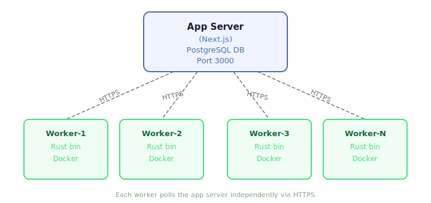

# Judge Workers

JudgeKit supports N concurrent judge workers connecting to a single app server. Workers can run on the same machine or be distributed across dedicated hosts.

## Architecture

Workers access the app via HTTP(S) only. The PostgreSQL runtime handles concurrent access. The atomic `UPDATE...RETURNING` claim SQL prevents race conditions — only one worker can claim a given submission.

<p align="center">
  
</p>

## Worker Lifecycle

### Registration

On startup, the worker POSTs to `/api/v1/judge/register` with its hostname and concurrency. The server returns a `workerId` and heartbeat interval.

If registration fails, the worker exits by default. Set `JUDGE_ALLOW_UNREGISTERED_MODE=1` only when you explicitly want degraded standalone operation.

### Heartbeat

A background task POSTs to `/api/v1/judge/heartbeat` every 30 seconds with:
- `workerId` — identifies the worker
- `activeTasks` — current in-flight submission count
- `availableSlots` — remaining concurrency capacity
- `uptimeSeconds` — worker uptime

The heartbeat endpoint piggybacks a staleness sweep: workers whose last heartbeat exceeds `3 * heartbeatInterval` are marked `stale`.

### Claiming

Workers poll `/api/v1/judge/claim` to claim submissions. The claim request includes the optional `workerId`, which is recorded on the submission for tracking and audit.

### Graceful Shutdown (SIGTERM)

1. Stops claiming new submissions
2. Awaits all in-flight tasks to complete
3. Cancels the heartbeat task
4. POSTs to `/api/v1/judge/deregister`
5. Exits

### Fault Tolerance

| Scenario | Mitigation |
|----------|-----------|
| Two workers claim same submission | Atomic `UPDATE...RETURNING` — only one gets the row |
| Worker crashes mid-judging | Stale claim timeout (configurable, default 5 min) — reclaimed by next worker |
| Worker reports result after reclaim | Claim token mismatch — 403 rejected |
| Heartbeat failure | After 3 consecutive failures, logs warning; worker keeps running |

## Configuration

### Worker Environment Variables

| Variable | Default | Description |
|----------|---------|-------------|
| `JUDGE_BASE_URL` | `http://localhost:3000/api/v1` | App server API URL |
| `JUDGE_AUTH_TOKEN` | (required, ≥32 chars) | Shared bootstrap token. Authorises **registration only**; once a worker is registered the app rejects `claim` / `heartbeat` / `deregister` calls that present this token instead of the per-worker `secretTokenHash` (since 2026-05). |
| `RUNNER_AUTH_TOKEN` | (required, ≥32 chars) | Bearer token for runner/docker-admin endpoints. The worker validates strictly: the value must be present, ≥32 chars, and different from `JUDGE_AUTH_TOKEN`. `docker-compose.worker.yml` now requires this variable at interpolation time so dedicated workers fail before startup when it is missing. |
| `JUDGE_ALLOW_INSECURE_HTTP` | `false` | Development-only escape hatch for non-local `http://` `JUDGE_BASE_URL` / `JUDGE_POLL_URL` values. Remote/dedicated workers should use HTTPS; local Docker service host `http://app:3000` and loopback URLs are allowed without this flag. |
| `JUDGE_ALLOW_DEFAULT_COMPILE_SECCOMP` | `false` | Explicitly let compile containers fall back to Docker's default seccomp profile |
| `JUDGE_CONCURRENCY` | `1` | Max concurrent submissions (1-16) |
| `JUDGE_WORKER_HOSTNAME` | System hostname | Hostname reported to app server |
| `POLL_INTERVAL` | `500` | Polling interval in ms when the queue has work. Empty-queue polls back off exponentially (×2 per consecutive empty poll) capped at 3 s. Lowering `POLL_INTERVAL` directly reduces pickup latency on a freshly created submission but raises baseline DB QPS proportionally per worker. |
| `WORKER_PREWARM_IMAGES` | `judge-cpp,judge-python,judge-jvm,judge-node,judge-rust,judge-go` | Comma-separated list of judge-* image tags to "prewarm" at worker startup by running `docker run --rm <image> true` once. This pulls the image layers into the OS page cache so the FIRST submission targeting each language doesn't pay the cold-disk read cost on top of docker spawn. Each prewarm is capped at 10 s; missing images log a warning and are skipped. Set to empty string to disable entirely. |
| `WORKER_WARM_POOL_DISABLE` | `false` | Operator kill switch for the [warm container pool](#warm-container-pool). When `true`, the worker ignores whatever warm-pool targets the app sends in `register`/`heartbeat` and judges every test case with a cold `docker run`. |
| `DEAD_LETTER_DIR` | `./dead-letter` | Directory for failed result payloads |

## Deployment

### Single-machine (co-located)

The judge worker is part of `docker-compose.production.yml` by default. No profile flag is needed:

```bash
docker compose -f docker-compose.production.yml --env-file .env.production up -d
```

> The worker used to be gated behind `profiles: ["worker"]`, but forgetting `--profile worker` during a manual recovery caused a silent worker outage in Apr 2026. The profile has been removed so the worker always starts with the rest of the stack.

### Dedicated workers

Use `docker-compose.worker.yml` on separate machines:

```bash
JUDGE_BASE_URL=https://oj.example.com/api/v1 \
JUDGE_AUTH_TOKEN=your-token \
RUNNER_AUTH_TOKEN=separate-runner-token \
JUDGE_CONCURRENCY=4 \
docker compose -f docker-compose.worker.yml up -d
```

The dedicated worker compose file includes a local `docker-proxy` sidecar. The judge worker reaches Docker through `DOCKER_HOST=tcp://docker-proxy:2375` instead of mounting `/var/run/docker.sock` directly, which narrows direct daemon exposure. The worker container itself no longer needs `SYS_ADMIN` or AppArmor overrides to do that.

By default, the dedicated worker compose file now enables only container lifecycle access on the proxy. If you intentionally want the remote worker to expose image/build management through the runner, opt in with:

```bash
WORKER_DOCKER_PROXY_IMAGES=1 \
WORKER_DOCKER_PROXY_BUILD=1 \
WORKER_DOCKER_PROXY_POST=1 \
WORKER_DOCKER_PROXY_DELETE=1
```

It also publishes the Rust runner on host loopback:

```text
127.0.0.1:${RUNNER_PORT:-3001}:3001
```

That loopback port is useful for split app/worker topologies such as
the app host reaching the worker runner through an SSH tunnel / host bridge
path instead of running a co-located judge worker.

Outside containerized deployments, the Rust runner now defaults to `127.0.0.1` unless `RUNNER_HOST` is set explicitly. The Docker compose files still set `RUNNER_HOST=0.0.0.0` where container port publishing is required.

> **Required:** set `RUNNER_AUTH_TOKEN` separately from `JUDGE_AUTH_TOKEN` in production so a leaked judge polling token does not automatically authorize the runner's Docker-management endpoints. The worker no longer falls back to `JUDGE_AUTH_TOKEN` when `RUNNER_AUTH_TOKEN` is unset.

> **Compile seccomp:** compile containers now use the repository seccomp profile by default too. If a specific toolchain is incompatible with that profile, set `JUDGE_ALLOW_DEFAULT_COMPILE_SECCOMP=1` explicitly as a compatibility escape hatch instead of relying on the weaker default implicitly.

> **Important:** this horizontal scaling guidance applies to **judge workers**.
> The main Next.js app now supports two realtime modes for the routes that need
> shared coordination:
> - process-local single-instance mode (`APP_INSTANCE_COUNT=1` or
>   `REALTIME_SINGLE_INSTANCE_ACK=1`)
> - PostgreSQL-backed shared coordination mode
>   (`REALTIME_COORDINATION_BACKEND=postgresql`) for SSE connection-cap
>   enforcement and anti-cheat heartbeat deduplication
>
> `redis` remains unsupported. App-server replication still requires validated
> sticky-session/load-balancer behavior before it is safe to rely on
> multi-instance operation for serious contest or exam use.

### Deploy script

Automates image transfer and setup for remote machines:

```bash
./scripts/deploy-worker.sh \
  --host=192.168.1.10 \
  --app-url=https://oj.example.com/api/v1 \
  --concurrency=4 \
  --sync-images
```

Options:
- `--host=<ip>` — Target machine (required)
- `--app-url=<url>` — App server API URL (required)
- `--token=<token>` — Judge auth token (reads from `.env.production` if omitted)
- `--concurrency=<n>` — Max concurrent submissions (default: 4)

The deploy script now copies the worker `.env` file with mode `0600` instead of embedding the shared judge token directly into a remote shell heredoc.
- `--sync-images` — Also transfer judge language Docker images
- `--ssh-user=<user>` — SSH user (default: root)

### Docker Image Distribution

For 2-3 workers, `deploy-worker.sh --sync-images` transfers images via `docker save | ssh | docker load`.

For larger fleets, use `deploy-worker.sh --sync-images` or your own registry/distribution tooling. `JUDGE_DOCKER_REGISTRY` is not a current built-in startup-pull feature.

## Spawn-latency optimizations

Each submission ends up running N+1 `docker run` invocations on the worker host: one to compile and one per test case. With many test cases, container cold-spawn time (50-300 ms per spawn) starts to dominate end-to-end judging latency. Isolation must be preserved between submissions, so reusing a container across users is not an option. Two complementary tactics are available — both keep the per-submission, per-test container model untouched.

### Image page-cache prewarm (built-in, on by default)

On startup, the worker runs `docker run --rm <image> true` once for each image in `WORKER_PREWARM_IMAGES` (default: the popular language set). The dummy command exits immediately, but the image layers are read from disk into the OS page cache. The next real submission targeting that language hits warm memory instead of cold disk, cutting cold-spawn latency by 100-200 ms on a typical SSD. No isolation impact — the prewarm container is the same `--rm` short-lived shape as a real submission's.

Tune the list with `WORKER_PREWARM_IMAGES` (empty string to disable). Missing images log a warning and are skipped, so a worker host that doesn't carry the full popular set doesn't fail prewarm.

### crun runtime (opt-in via host setup)

By default Docker uses `runc` (Go) as its low-level OCI runtime. `crun` (C) is a fully OCI-compliant drop-in replacement that's typically 30-50 ms faster on container create/start. For an online judge that compounds across N+1 spawns per submission and across thousands of submissions per hour.

Apply once per worker host:

```bash
ssh <worker-host> 'bash -s' < scripts/install-crun-runtime.sh
```

The script installs `crun` via apt, merges `default-runtime: crun` into `/etc/docker/daemon.json` (backing up any existing config), and restarts the Docker daemon. Idempotent — re-running with crun already set is a no-op.

Verify after the script runs:

```bash
docker info | grep -i 'default runtime'   # should print "Default Runtime: crun"
```

Roll back by editing `/etc/docker/daemon.json` to set `default-runtime` back to `runc` and restarting Docker — image layers, networks, and volumes are runtime-independent so a switch back is non-destructive.

## Warm container pool

Beyond page-cache prewarm and the `crun` runtime, the worker can keep a small
pool of **idle, already-started** judge containers around so the RUN phase of
a submission skips container create/start entirely. This is a separate,
opt-in mechanism layered on top of the two optimizations above — both keep
working unmodified whether or not the pool is enabled.

### What it does

- **Per docker image, not per language.** `judge-cpp:latest` serves both C
  (`c17`/`c23`) and C++ (`cpp20`/`cpp23`/`cpp26`), so the admin UI lets you
  pick a warm count per language, but counts for languages sharing an image
  are merged with **MAX, not SUM** — two idle `judge-cpp` containers can serve
  either a C or a C++ submission, so provisioning "2 for C" and "2 for C++"
  yields 2 idle containers, not 4.
- **Single use.** Each warm container (`oj-warm-*`) serves exactly **one test
  case**, then is destroyed and asynchronously replenished. Isolation between
  submissions — and between test cases — is identical to the cold path.
- **RUN only, never COMPILE.** Compilation always runs in a fresh cold
  `docker run`; only test-case execution can use a warm container. Compile is
  a single invocation per submission (low leverage) and uses a different
  seccomp profile than execution, so keeping it out of the pool avoids
  mixing security profiles.
- **Per-submission limits still apply.** A warm container is adopted with
  `docker update` to the submission's own memory/CPU/pids limits and gets a
  read-only bind-mounted staging directory at `/workspace` before `docker
  exec` runs the test case, so measured time and memory match the cold path.
  `memory.peak` is reset before each case so peak memory never accumulates
  across test cases run in the same recycled container slot.
- **Always has a cold fallback.** Anything the warm path cannot safely
  handle — pool empty, a dead/unhealthy container, a submission's memory
  limit above the pool's ~1024 MiB warm ceiling, a `needs_exec_tmp` language
  (.NET/Mono, which needs a real writable temp mount the warm workspace
  doesn't provide), or a result too close to the time/memory limit to trust
  the warm-path measurement — falls straight back to a normal cold `docker
  run`. Judging correctness never depends on the pool being available.

### Configuring it

Admins control the pool at **`/dashboard/admin/settings`**:
- a global on/off switch,
- which languages stay warm, and
- how many idle containers to keep per language.

The setting is stored as `system_settings.warm_pool` (JSONB), normalized
server-side to per-docker-image targets (`resolveWarmPoolTargets` in
`src/lib/judge/warm-pool.ts`) before being handed to workers.

### How changes reach workers

There is no redeploy or worker restart involved. The app includes the
resolved pool targets in both the `register` and `heartbeat` responses
(`/api/v1/judge/register`, `/api/v1/judge/heartbeat`). A worker adopts new
targets from `register` at startup and re-reconciles against them on every
heartbeat (~30 seconds), so an admin change takes effect fleet-wide within
about one heartbeat interval — increase a count and the worker creates more
idle containers; set a count to 0 and the worker tears the excess down.

### Kill switch

`WORKER_WARM_POOL_DISABLE=true` on a worker forces it to ignore whatever pool
targets the app sends and judge every test case with a cold `docker run`,
regardless of the admin setting. This is the operator-side escape hatch —
useful for isolating whether an incident is warm-pool-related without
touching the admin config or restarting the app.

### Default-enabling a deployment

`WARM_POOL_DEFAULT_ENABLED` (app env var, read by
`defaultWarmPoolConfig()` in `src/lib/judge/warm-pool.ts`) makes the pool
default **on** — seeded with `python: 2, cpp20: 2, c17: 2` — for a deployment
until an admin saves an explicit `warmPool` value from the settings page.
Once an admin has saved a value, this env var no longer has any effect; the
DB row always wins.

This variable is read by the **Next.js app process itself**, so it only
takes effect if it is present in the environment the app container actually
starts with. Concretely, for `docker-compose.production.yml`, that means
`.env.production` on the target host (`env_file: - .env.production` on the
`app` service) — **not** `.env.deploy.<target>` files such as
`.env.deploy.auraedu`. Those `.env.deploy.*` files are sourced locally by
`deploy-docker.sh` itself to configure the deploy *script's* own shell
variables (`DOMAIN`, `REMOTE_HOST`, `SSH_KEY`, worker/build flags); they are
never copied into the running app or worker container, so setting
`WARM_POOL_DEFAULT_ENABLED` there is silently ignored.

For the `oj`/`auraedu` deployment, `deploy-docker.sh` backfills
`WARM_POOL_DEFAULT_ENABLED=true` into the remote `.env.production`
automatically (backfill-only — it will not overwrite a value an operator has
since changed there) whenever `DEPLOY_TARGET=oj` or `DEPLOY_TARGET=auraedu`.
Other deployments stay off by default unless the same variable is set
explicitly in their own `.env.production`.

### Pre-production validation checklist

The automated test suite (`vitest`, `tsc`, `lint`, `cargo test`, `cargo
clippy`) covers the config/normalization/propagation logic and the Rust
pool-manager and fallback-selection logic against Docker mocks. It does
**not** exercise a real Docker daemon, real judge images, or a real worker
process. Before enabling the pool against real traffic on `oj` (or any other
deployment), an operator should confirm on a live staging deployment:

- [ ] **Warm-pool-off is a no-op.** With `WARM_POOL_DEFAULT_ENABLED` unset
      and `WORKER_WARM_POOL_DISABLE=true` on the worker, submit a Python and
      a C++ solution. Judging succeeds, worker logs show no `created warm
      container` lines, and verdicts/time/memory match a pre-change run.
- [ ] **Pool creation.** Enable the pool in `/dashboard/admin/settings`
      (Python 3 = 2, C++ = 2, C = 2) and save. Within ~30s, worker logs show
      `created warm container` for `judge-cpp:latest` and
      `judge-python:latest`, and `docker ps` shows `oj-warm-*` containers
      idling.
  - [ ] **Correctness under warm execution.** Submit Python, C++, and C
      solutions with multiple test cases each. Verdicts are correct;
      per-test-case time and memory readings fall in the same range as a
      cold run; peak memory does **not** accumulate across test cases within
      a recycled container (the `memory.peak`/cgroup reset guard); consumed
      `oj-warm-*` containers are replenished.
- [ ] **Scale-to-zero.** Set the pool count to 0 for all languages and save.
      Within ~30s, all `oj-warm-*` containers disappear and judging
      continues normally on the cold path.
- [ ] **Fallback under pressure.** With the pool sized smaller than expected
      concurrency (e.g. 1 idle container against 3 simultaneous
      submissions), confirm the overflow submissions still judge correctly
      via the cold fallback rather than erroring or queuing indefinitely.

## Admin Dashboard

The workers admin page at `/dashboard/admin/workers` (requires `system.settings` capability) shows:

- **Stats cards** — Workers online, queue depth, active judging, total concurrency
- **Workers table** — Alias, hostname, IP address, status, concurrency, active tasks, version, last heartbeat
- **Alias editing** — Click the pencil icon to set a friendly name for each worker
- **Force-remove** — Remove a worker and reclaim its in-flight submissions

Data auto-refreshes every 10 seconds.

## API Endpoints

| Endpoint | Method | Auth | Purpose |
|----------|--------|------|---------|
| `/api/v1/judge/register` | POST | Bearer | Worker registration |
| `/api/v1/judge/heartbeat` | POST | Bearer | Periodic health ping |
| `/api/v1/judge/deregister` | POST | Bearer | Graceful shutdown |
| `/api/v1/judge/claim` | POST | Bearer | Claim a submission (accepts optional `workerId`) |
| `/api/v1/judge/poll` | POST | Bearer | Report status/result |
| `/api/v1/admin/workers` | GET | Session | List all workers |
| `/api/v1/admin/workers/stats` | GET | Session | Aggregate stats |
| `/api/v1/admin/workers/:id` | DELETE | Session | Force-remove worker |
